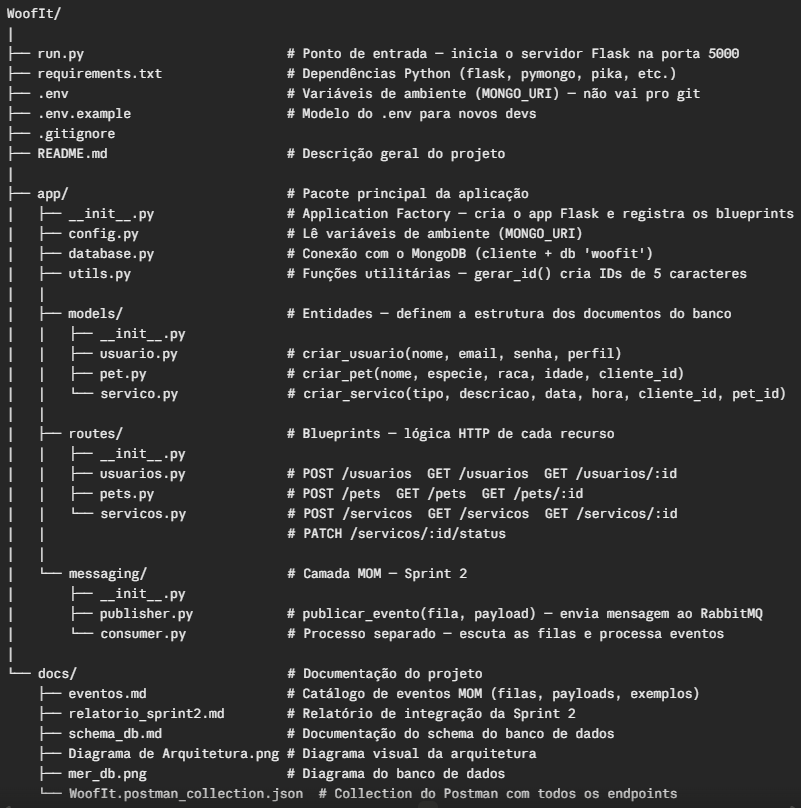

# WoofIt 
WoofIt é uma plataforma de intermediação de serviços para pets que conecta
**tutores de animais** a **pet sitters e dog walkers** de forma ágil e confiável.

Por meio do aplicativo, o tutor cadastra seu pet, solicita um serviço (passeio,
visita ou hospedagem) e acompanha o status em tempo real. O prestador recebe as
demandas disponíveis, aceita ou recusa, e atualiza o andamento do serviço.

> Projeto da disciplina **Laboratório de Desenvolvimento de Aplicações Móveis e
> Distribuídas** — Engenharia de Software, PUC Minas 

## Backend REST

Backend da plataforma **WoofIt**, que conecta donos de pets (clientes) a pet
sitters e dog walkers (prestadores de serviços).

Projeto da disciplina LAMD — PUC Minas, Sprint 1.

## Tecnologias

| Camada | Tecnologia | Justificativa |
|--------|-----------|---------------|
| API REST | Flask 3.x (Python) | Minimalista, ideal para APIs REST educacionais |
| Banco de dados | MongoDB 8.x | NoSQL orientado a documentos; schema flexível para diferentes tipos de serviço |
| Driver | pymongo | Driver oficial MongoDB para Python |

## Estrutura 


## Perfis de Usuário
- **cliente** — Dono do pet: cadastra animais e cria solicitações de serviço
- **prestador** — Pet sitter/walker: visualiza e aceita solicitações

## Fluxo de Status do Serviço
`pendente` → `aceito` → `em_andamento` → `concluido`  
Qualquer estado pode ir para `cancelado`

## Endpoints (Sprint 1)
| Método | Rota | Descrição |
|--------|------|-----------|
| POST | /usuarios | Cadastra cliente ou prestador |
| GET | /usuarios | Lista usuários |
| GET | /usuarios/\<id\> | Busca por ID |
| POST | /pets | Cadastra pet |
| GET | /pets | Lista pets (filtro: ?cliente_id=) |
| GET | /pets/\<id\> | Busca pet por ID |
| POST | /servicos | Cria solicitação de serviço |
| GET | /servicos | Lista serviços (filtros: ?status= e ?tipo=) |
| GET | /servicos/\<id\> | Busca serviço por ID |
| PATCH | /servicos/\<id\>/status | Atualiza status |

## Como executar
```bash
# 1. Criar ambiente virtual (isola as bibliotecas deste projeto)
python -m venv venv

# 2. Ativar (Windows PowerShell)
.\venv\Scripts\Activate.ps1

# 3. Instalar dependências
pip install -r requirements.txt

# 4. Copiar e preencher variáveis de ambiente
copy .env.example .env

# 5. Garantir que o RabbitMQ está rodando
# Abra o PowerShell como Administrador e rode:
sc.exe start RabbitMQ

# 6. Iniciar o servidor Flask (Terminal 1)
python run.py

# 7. Iniciar o consumer de eventos (Terminal 2)
python -m app.messaging.consumer