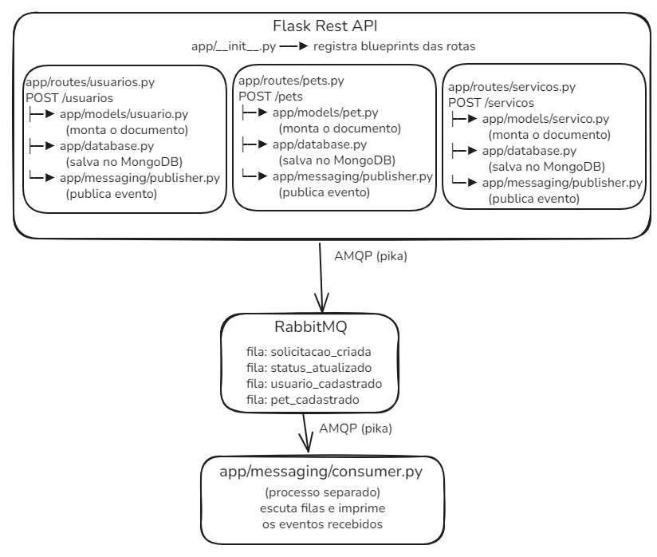

# Relatório Sprint 2 — Integração MOM (RabbitMQ)

**Projeto:** WoofIt  
**Disciplina:** Laboratório de Desenvolvimento de Aplicações Móveis e Distribuídas  
**Curso:** Engenharia de Software — PUC Minas  

---

## Objetivo

Integrar um middleware orientado a mensagens (MOM) ao backend REST desenvolvido na Sprint 1, implementando uma arquitetura orientada a eventos (EDA) para desacoplar a publicação de notificações das operações principais da API.

---

## Tecnologias utilizadas

| Tecnologia | Versão | Papel |
|------------|--------|-------|
| RabbitMQ | 4.0.9 | Message broker AMQP |
| Erlang OTP | 26.2.5 | Runtime do RabbitMQ |
| pika | 1.4.1 | Biblioteca Python para AMQP |

---

## Arquitetura implementada
---


## Componentes desenvolvidos

### `app/messaging/publisher.py`

Responsável por publicar eventos nas filas do RabbitMQ.

- Cria uma conexão `BlockingConnection` com o broker local
- Declara a fila com `durable=True` (sobrevive a reinicializações)
- Serializa o payload para JSON e adiciona `timestamp` automático
- Usa `delivery_mode=2` para persistência das mensagens no disco
- **Resiliência:** encapsulado em `try/except` — falha do MOM não derruba a API

### `app/messaging/consumer.py`

Processo independente que escuta as filas e processa eventos.

- Conecta ao broker e declara as filas `solicitacao_criada` e `status_atualizado`
- Registra callback `processar_mensagem` para cada fila
- Confirma processamento com `basic_ack` (sem confirmação, RabbitMQ reencaminha)
- Executado com `python -m app.messaging.consumer` em terminal separado

### Integração em `app/routes/servicos.py`

Dois pontos de publicação foram adicionados às rotas existentes:

1. **POST /servicos** → publica `solicitacao_criada` após inserir no MongoDB
2. **PATCH /servicos/:id/status** → publica `status_atualizado` após atualizar no MongoDB

---

## Eventos implementados

| Evento | Fila | Gatilho |
|--------|------|---------|
| `usuario_cadastrado` | `usuario_cadastrado` | POST /usuarios com sucesso |
| `pet_cadastrado` | `pet_cadastrado` | POST /pets com sucesso |
| `solicitacao_criada` | `solicitacao_criada` | POST /servicos com sucesso |
| `status_atualizado` | `status_atualizado` | PATCH /servicos/:id/status com sucesso |

Detalhes completos dos payloads em [`docs/eventos.md`](eventos.md).

---

## Como executar

```bash
# Terminal 1 — API REST
.\venv\Scripts\Activate.ps1
python run.py

# Terminal 2 — Consumer MOM
.\venv\Scripts\Activate.ps1
python -m app.messaging.consumer
```

O RabbitMQ deve estar rodando (serviço Windows `RabbitMQ`).

---

## Testes realizados

| Ação | Evento esperado | Resultado |
|------|----------------|-----------|
| POST /servicos | `solicitacao_criada` publicado na fila | ✅ Confirmado |
| PATCH /servicos/:id/status | `status_atualizado` publicado na fila | ✅ Confirmado |
| Consumer offline | API continua funcionando | ✅ Confirmado (try/except) |

---

## Decisões de projeto

**Por que filas separadas e não uma única fila?**  
Filas separadas permitem que consumidores diferentes se inscrevam apenas nos eventos de interesse — um serviço de notificação pode escutar só `solicitacao_criada`, enquanto um serviço de auditoria escuta ambas.

**Por que `durable=True` e `delivery_mode=2`?**  
Garante que mensagens não sejam perdidas se o RabbitMQ reiniciar. Em produção, isso é essencial para rastreabilidade de serviços. Com durable=True, a fila sobrevive à reinicialização e continua lá quando o broker voltar. Com delivery_mode=2, o RabbitMQ grava cada mensagem no disco antes de confirmar o recebimento e se travar no meio do caminho, as mensagens continuam salvas.

**Por que o consumer é um processo separado?**  
Separação de responsabilidades: a API REST serve requisições HTTP síncronas; o consumer processa mensagens de forma assíncrona e independente. Poderiam rodar em máquinas diferentes.

## Desafios
O principal obstáculo que enfrentei durante a Sprint 2 foi a configuração inicial do RabbitMQ no meu notebook. Como o RabbitMQ depende do Erlang para funcionar, existe uma matriz de compatibilidade muito restrita entre as versões de ambas as tecnologias.

Inicialmente, instalei a versão mais recente do Erlang, a OTP 29, e a versão 4.0.9 do RabbitMQ. Após muitos erros verifiquei que a versão que instalei do RabbitMQ possui suporte apenas para as versões OTP 26 e 27. Essa divergência fez com que o serviço do RabbitMQ até aparecesse como "em execução" no painel do Windows, mas falhasse silenciosamente logo em seguida, impedindo que a porta 5672 ficasse disponível para aceitar conexões.

Para solucionar, eu fiz o downgrade do Erlang, desinstalando a versão OTP 29 e instalando a versão OTP 26.2.5, que é compatível com o nosso broker. Além da troca de versão, também exclui os arquivos do banco de dados interno do RabbitMQ gerados nas tentativas anteriores, pois eles haviam sido corrompidos pelo erro de leitura. Após isso, o RabbitMQ conseguiu inicializar o banco de dados do zero e consegui rodar sem erros.